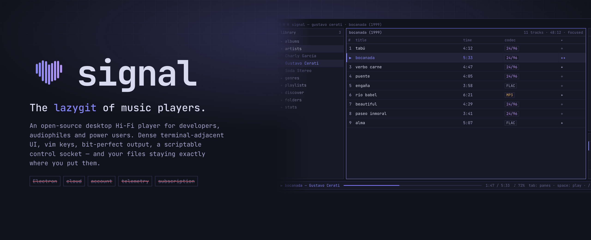

<div align="center">


# signal

<br />

[](https://www.rust-lang.org)
[](https://v2.tauri.app)
[](https://react.dev)
[](Cargo.toml)
[](#development)
[](docs/07-roadmap.md)

[**Website**](https://ianaya89.github.io/signal/) · [Design docs](#design-docs) · [Keyboard](#keyboard) · [CLI](#cli) · [Roadmap](docs/07-roadmap.md)

</div>

---

Not another Apple Music clone. Not another Plexamp clone. No cloud, no account,
no telemetry, no Electron — just your files, one SQLite database, and a UI dense
enough to actually show what's going on.

<div align="center">
  
</div>

## Why

- **Bit-perfect, and it proves it.** Exclusive device mode, automatic sample-rate
  switching, gapless, ReplayGain — and an inspector that shows the whole audio
  path stage by stage (file → decode → dsp → output → device) so the claim is
  verifiable, not a badge.
- **Keyboard-first.** Vim-influenced normal mode, command palette, and a `?`
  overlay generated from the live binding registry. Mouse optional.
- **Local-first.** One SQLite file you can back up, inspect or delete. Tags read
  and written in place. Works fully offline.
- **Scriptable.** A Unix control socket speaking newline-delimited JSON, plus a
  `signal` CLI on top of it. Composes with tmux, Raycast, Stream Deck, cron.
- **Transparent.** Technical values shown raw: `44.1kHz`, not "CD Quality".

## Features

**Library**
Multi-root scanning with an fs-watcher · per-folder removal and exclusions ·
FTS5 search · multi-genre · various-artists detection · m3u import · cover-art
fetch · metadata editor with tag write-back · album/track rename.

**Playback**
libmpv — FLAC, ALAC, WAV, AIFF, AAC, MP3, OGG, Opus · gapless · ReplayGain
(track/album) · exclusive mode · auto sample-rate switching · bit-perfect
detection · output device picker · queue staging, reorder and save-as-playlist.

**Organise**
Playlists and smart playlists (rule sets) · `✦` like / `✦✦` love ratings · `♥`
favorites · discover shelves (on repeat, rediscover, from your artists, never
played) computed with plain SQL over your own listening history · stats view.

**Maintenance**
Doctor view: find missing files, relink moved ones, resolve duplicates, prune
dead paths · library backup · rescan · config file access.

**Interface**
Three-pane dense layout · command palette · logs view · two themes (indigo dark,
manila light) · three window modes (full, mini bar, 76px pulse dot) · ListenBrainz
scrobbling.

## Stack

| Layer | Choice |
|---|---|
| Backend | Rust stable (1.82+), Tauri v2 |
| Playback | libmpv |
| Data | SQLite + sqlx, FTS5, lofty tags, notify fs-watcher |
| Frontend | React 19, TypeScript, TailwindCSS 4, TanStack Router/Query, Zustand, uPlot |
| Crates | `signal-core` · `-db` · `-player` · `-scanner` · `-search` · `-plugins` · `-cli` |

## Install

```sh
curl -fsSL https://ianaya89.github.io/signal/install.sh | sh
```

- **macOS 11+** (arm64 / x86_64) — mounts the `.dmg`, copies `signal.app` to
  `/Applications`, clears the quarantine flag. libmpv and its ffmpeg tree ride
  along inside the bundle, so Homebrew is not required.
- **Ubuntu 24.04+ / Debian 13+** — installs the `.deb` via apt, which pulls `libmpv2`.
- **Other Linux (x86_64)** — drops the self-contained AppImage at
  `~/.local/bin/signal-app`; libmpv rides along, so older releases work too.

Artifacts are also attached to every [release](https://github.com/ianaya89/signal/releases).
macOS builds are ad-hoc signed, not notarized: a manual download needs
right-click → Open once, or `xattr -dr com.apple.quarantine /Applications/signal.app`.

No release is published yet — until the first tag lands, the installer says so
and points at the build steps below.

## Development

Rust toolchain is managed by [mise](https://mise.jdx.dev) (`mise.toml`).

```sh
# first time
mise trust && mise install
pnpm install
brew install pkgconf mpv   # libmpv + its pkg-config metadata

# run
pnpm tauri dev
```

If `cargo` is not found, either activate mise in your shell
(`eval "$(mise activate zsh)"` in `~/.zshrc`) or run `mise exec -- pnpm tauri dev`.

```sh
pnpm typecheck                       # tsc --noEmit
cargo clippy --workspace -- -D warnings
cargo test --workspace
```

The crate is `signal-app`, but macOS bundles ship the binary as `signal`
(`src-tauri/tauri.macos.conf.json` sets `mainBinaryName`) — so a macOS
`pnpm tauri build` overwrites `target/release/signal` with the app, where
`cargo build --release -p signal-cli` puts the CLI. Rebuild the CLI after a
bundle build. Linux keeps `signal-app` on purpose: the `.deb` would otherwise
install `/usr/bin/signal` and collide with the CLI.

## Releasing

The git tag is the single source of truth: `scripts/set-version.sh` writes it
into `Cargo.toml`, `src-tauri/tauri.conf.json` and `package.json` at build time,
so no manual pre-tag bump is needed.

```sh
git tag v0.2.0 && git push origin v0.2.0
```

That tag starts [`.github/workflows/release.yml`](.github/workflows/release.yml)
and opens a **draft** release. The `.deb` is built on `ubuntu-24.04` because it
links the host's libmpv and must match the `libmpv2` it declares; the AppImage
is built on `ubuntu-22.04`, which only sets its glibc floor since libmpv travels
inside it. macOS is built locally — GitHub's macOS runners bill at 10x, and the
dmg needs Homebrew's libmpv folded in anyway:

```sh
./scripts/release-local.sh 0.2.0 --publish
```

That script builds `signal.app` for the host architecture, runs `dylibbundler`
so libmpv and its ~48-library ffmpeg/libass tree live in
`Contents/Frameworks`, checks that no `/opt/homebrew` path survived, signs
(ad-hoc unless `APPLE_SIGNING_IDENTITY` is exported), assembles the `.dmg` with
`hdiutil`, and uploads it to the same draft release. Review the draft, then
publish it.

| Script | Does |
|---|---|
| [`scripts/set-version.sh`](scripts/set-version.sh) | Writes a version into every manifest |
| [`scripts/release-local.sh`](scripts/release-local.sh) | macOS `.dmg`, self-contained, optional upload |
| [`scripts/appimage-bundle-mpv.sh`](scripts/appimage-bundle-mpv.sh) | Folds libmpv into the AppImage in CI and repacks it |
| [`scripts/make-images.sh`](scripts/make-images.sh) | Re-renders the README/OG images from `docs/index.html` |

## CLI

signal is scriptable: the app exposes a Unix control socket speaking
newline-delimited JSON, and ships a `signal` CLI on top of it.

```sh
cargo build -p signal-cli        # binary at target/debug/signal

signal status                    # ▶ Daft Punk — Get Lucky  1:02/6:09 · bit-perfect
signal status --json             # machine-readable, for scripts/statuslines
signal play get lucky            # search & play (results become the context)
signal add instant crush         # stage onto the queue
signal seek +30                  # relative seek
signal vol 80                    # or +5 / -5
signal toggle | next | prev | stop | queue | search <query>
```

Socket: `$SIGNAL_SOCKET` or the app data dir (`signal.sock`). Anything that
can write JSON to a socket — Raycast, tmux, Stream Deck — can drive signal.

## Keyboard

Press `?` in-app for the live registry ([`src/lib/bindings.ts`](src/lib/bindings.ts)).

| Playback | | Navigate | |
|---|---|---|---|
| `space` | play / pause | `j` `k` | move down / up |
| `{` `}` | previous / next track | `gg` `G` | jump to top / bottom |
| `[` `]` | seek −5s / +5s | `enter` | play from here |
| `=` `-` | volume up / down | `esc` | back |
| `m` | mute / unmute | `tab` | cycle panes |

| Library | | Layout | |
|---|---|---|---|
| `a` | stage track to queue | `b` | toggle library pane |
| `x` | remove (queue / playlist) | `i` | toggle inspector pane |
| `f` | toggle favorite | `M` | mini player |
| `r` then `0`–`5` | rate track (`0` clears) | `P` | pulse mode |
| `/` | search | `1` `2` `3` | focus library / main / inspector |
| `ctrl+p` · `cmd+k` | command palette | `S` `L` `D` | stats / logs / discover |

## Design docs

Written before the code, kept in the repo.

| Doc | Covers |
|-----|--------|
| [01 — Architecture](docs/01-architecture.md) | Components, threads, event bus, data flows, error strategy |
| [02 — Workspace](docs/02-workspace.md) | Cargo workspace layout, crates, dependency rules, feature flags |
| [03 — Database schema](docs/03-database-schema.md) | Full DDL, FTS5 setup, smart playlist rules, repositories |
| [04 — Player (libmpv)](docs/04-player-libmpv.md) | mpv wrapper, gapless, ReplayGain, exclusive mode, bit-perfect detection |
| [05 — IPC API](docs/05-ipc-api.md) | Tauri command catalog, events, DTOs, artwork protocol |
| [06 — Frontend](docs/06-frontend.md) | Routing, state split (Query vs Zustand), components, event bridge |
| [07 — Roadmap](docs/07-roadmap.md) | Milestones M0–M5, exit criteria, risk register |
| [08 — Plugins](docs/08-plugins.md) | Plugin trait, tiers, lifecycle, MPRIS / Last.fm / Discord sketches |
| [09 — Keyboard](docs/09-keyboard.md) | Mode stack, full binding tables, rebinding, discoverability |
| [10 — Design system](docs/10-design-system.md) | Palette, typography, density, component specs, motion rules |

The landing page in [`docs/index.html`](docs/index.html) is published from this
folder via GitHub Pages.

## Principles

- Everything is local. Everything works offline.
- Every interaction feels instant. Performance is a feature.
- Every action has a keyboard shortcut. Mouse optional.
- Expose technical details instead of hiding them.

## License

GPL-3.0-or-later.
